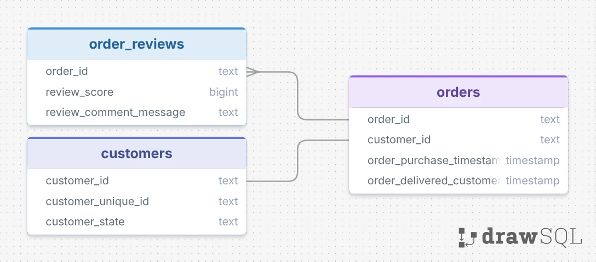

# Technical Methodology

[Olist Brazilian E-Commerce Dataset](https://www.kaggle.com/datasets/olistbr/brazilian-ecommerce)

# 1. Exploratory Pre-Analysis and Goal Setting

During the initial exploration, it became apparent that the Portuguese review text contained potentially valuable information that was not captured by the structured review score alone. A review of existing analyses of the dataset also showed relatively limited use of the textual review content, particularly through systematic classification of the messages. This gap motivated the decision to classify the reviews into meaningful categories, with the goal of exploring information that would otherwise remain largely unused.

To support this objective, the relevant data required for the analysis was identified. This included review messages and scores, the relationships necessary to associate reviews with individual customers through Reviews -> Order ID -> Customer ID -> Customer Unique ID. Order dates were also required to establish the chronological sequence of purchases and determine whether customers made subsequent purchases after a reviewed order.

---

# 2. Data Structure

The study was conducted using a copy of the orders table as the primary analytical dataset. The order_reviews and customers tables were joined to it using the relationships shown in the diagram.



# 3. Data Cleaning & Preparation

- Starting from 100k reviews, 800 of them had null review score. It was decided to discard them to not introduce ambiguity later in the analysis, after checking that they are distributed similarly to the rest of the data set in relevant categories.

- There was a column for review message titles. The majority of them were variations on *Recomendo, Otimo, Nao Recomendo*, which hint towards general sentiment rather than specific issues. Since It's less ambiguous to get this information from review scores, this column was ignored

---

# 4. Repurchases and Customer Purchase Histograms

An order was considered to have a repurchase when the same customer had a chronologically subsequent order. Subsequent orders were included regardless of their order status, including cancelled or still-in-progress orders, since the customer is displaying interest in  repurchasing.

Approximately 600 orders out of 100,000 occurred at the same timestamp for the same customer, indicating bundled transactions. These orders were treated as a single purchase event. The distribution of these bundled orders was compared with the rest of the dataset and found to be broadly consistent. Therefore, only one order in each bundle was retained for the purchase sequence, simplifying the construction of customer purchase histograms without materially altering the overall distribution. The last order by chronological delivery date was retained, since it's associated review should reflect customer sentiment more accurately:
```sql
WITH ranked_orders AS (
    SELECT
        order_id,
        ROW_NUMBER() OVER (
            PARTITION BY customer_unique_id, order_purchase_timestamp
            ORDER BY order_delivered_customer_date DESC NULLS LAST, order_id DESC
        ) AS bundle_rank
    FROM orders
)

DELETE FROM orders AS o
USING ranked_orders AS r
WHERE o.order_id = r.order_id
  AND r.bundle_rank > 1;
```


A number was assigned to each order, ranking them in chronological order within the same customer, and was stored in a new *purchases_so_far* column:
```sql
ALTER TABLE public.orders
ADD COLUMN purchases_so_far INTEGER;

WITH numbered_orders AS (
    SELECT
        order_id,
        ROW_NUMBER() OVER (
            PARTITION BY customer_unique_id
            ORDER BY order_purchase_timestamp, order_id
        ) AS purchase_number
    FROM orders
)
UPDATE orders AS o
SET purchases_so_far = n.purchase_number
FROM numbered_orders AS n
WHERE o.order_id = n.order_id;
```

With our orders ranked chronologically, the *days_to_next_order* by the same customer was stored in a new column, defaulting to null if no subsequent order happened:
```sql
ALTER TABLE public.orders
ADD COLUMN days_to_next_order INTEGER;

WITH next_orders AS (
    SELECT
        order_id,
        order_purchase_timestamp,
        LEAD(order_purchase_timestamp) OVER (
            PARTITION BY customer_unique_id
            ORDER BY purchases_so_far
        ) AS next_order_timestamp
    FROM orders )

UPDATE orders AS o
SET days_to_next_order =
    n.next_order_timestamp::DATE - n.order_purchase_timestamp::DATE
FROM next_orders AS n
WHERE o.order_id = n.order_id;
```

A simple boolean was stored in the new *had_subsequent_order* column for easier repurchase rate calculations later, by checking for if *days_to_next_order* was null or not.

Some checks were made to understand customers repurchase behavior, and to know the median time a customer will take to repurchase. It was 66 days:
```sql
WITH ranked AS (
    SELECT
        days_to_next_order,
        NTILE(10) OVER (
            ORDER BY days_to_next_order
        ) AS decile
    FROM analysis.all
    WHERE days_to_next_order IS NOT NULL
)

SELECT
    decile,
    ROUND(AVG(days_to_next_order), 0) AS avg_days,
    ROUND(
        PERCENTILE_CONT(0.5)
        WITHIN GROUP (ORDER BY days_to_next_order)
    ) AS median_days,
    COUNT(*) AS customers
FROM ranked
GROUP BY decile
ORDER BY decile;
```

```sql
SELECT
    ROUND(
        PERCENTILE_CONT(0.5)
        WITHIN GROUP (ORDER BY days_to_next_order)
    ) AS median_days
FROM analysis.all
WHERE days_to_next_order IS NOT NULL;
```

At this point it was possible to understand customer's repurchase rates, and some checks were made to improve our model. In particular, the correlation between review scores and average repurchase rate was of importance:
| Review Score | Repurchase Rate % | Count |
|---:|---:|---:|
| 1 | 2.37 | 9650 |
| 2 | 2.46 | 2598 |
| 3 | 2.61 | 6749 |
| 4 | 2.63 | 15409 |
| 5 | 3.33 | 44675 |
```sql
SELECT
    review_score,
    ROUND(AVG(had_subsequent_order::INTEGER) * 100, 2) AS repurchase_rate,
    COUNT(*) AS orders
FROM analysis.all
GROUP BY review_score
ORDER BY review_score;
```

It was initially assumed that customers will have gradual losses in repurchases as review scores got worse, but this analysis shows that a polar model between 5* reviews and 1-4* reviews adjusts customer rating behavior better. It was therefore decided that positive reviews will be those of 5*, and negative reviews those below 4*. Note that we are not calculating repurchase rate per customer, but rather by order and will keep doing it from now on.

It was also assumed that average repurchase rate would be higher, instead of the approx 3% observed. This was noted as the first insight from the study and shaped some modeling decisions later

The dataset showed an unusual decline in order frequency during approximately the final two months of the observation period, with a small but persistent tail of orders. This pattern suggested that the dataset may be subject to administrative censoring near its endpoint, meaning that the apparent decline may reflect incomplete observation rather than genuine changes in purchasing behavior.

Since the exact point at which the data became incomplete could not be reliably determined, a cutoff date was manually selected to approximate 66 days (median repurchase estimation) before the start of the censored period.

Orders after this cutoff were treated differently depending on whether a subsequent purchase had already been observed. Confirmed repurchases were retained, as they represent directly observed customer behavior and provide valuable observations for subsequent statistical analysis. Orders without a subsequent purchase were excluded, since they did not have sufficient observation time to reliably classify the customer as a non-repurchaser. this did not meaningfully inflate general repurchase rates:

```sql
DELETE FROM analysis.all
WHERE order_purchase_timestamp::DATE > '2018-06-01'
  AND had_subsequent_order = FALSE;
```

After these steps, the table had the new column **had_subsequent_order** as a way to quickly determine repurchase per order. Columns for **positive_message** & **negative_message** were added to later include review categories. It was decided to keep 2 columns instead of 1 for easier manipulation in Power BI. These 3 columns were the core columns later utilized in dashboard creation

---

# 5. Review Categorization Using an LLM in Python

**Ollama:** About 30,000 reviews contained messages written in Brazilian Portuguese. A locally hosted LLM, accessed through Ollama, was used to classify these messages into 12 distinct categories, such as delivery not received and easy service, allowing qualitative review text to be transformed into structured data for quantitative analysis.

The category taxonomy was developed manually through iterative trial runs. Initial classifications were manually inspected and the categories were progressively refined until they provided a useful balance between specificity and consistency.

The initial model selected for classification produced accurate results, but its computational requirements would have resulted in an estimated processing time of approximately 20 days. A compromise was found with **Qwen2.5:3B**, which provided sufficiently high classification precision while being substantially faster and clearing the task in 2 days. Classification quality was manually checked on trial outputs before processing the full dataset.

**Python:** Because positive and negative reviews required different classification taxonomies, two filtered copies of the reviews table were created in PostgreSQL, containing only reviews within the respective score ranges. These tables were then exported to CSV and processed in Python. The script handled prompting the LLM with each review message, extracting the resulting category, and periodically saving checkpoints so that processing could be resumed without losing completed classifications.

The Python script initially also validated the model's output against the predefined category list, since the model occasionally generated categories outside the intended taxonomy. This validation step was ultimately removed after it became apparent that these occasional category variations could be more effectively consolidated into the final taxonomy in SQL.

The resulting classified datasets were saved as two CSV files, containing the review messages alongside their assigned categories. These files were then imported back into PostgreSQL using pgAdmin.

**[View the complete Python script](./scripts/classify_reviews.py)**

---


# 9. Statistical Methodology

## 9.1 Descriptive Statistics

Explain which statistics were used and why.

Potential measures:

* Mean
* Median
* Standard deviation
* Percentiles
* Count
* Proportion
* Rate

Discuss when each measure is appropriate for the distribution being analyzed.

## 9.2 Rates and Proportions

Define the denominator explicitly.

For example:

[
\text{Repeat Rate} =
\frac{\text{customers with a subsequent purchase}}
{\text{eligible customers}}
]

Explain:

* Numerator
* Denominator
* Eligibility criteria
* Why this denominator was chosen

## 9.3 Sample Size Considerations

Explain whether categories with very small sample sizes were:

* Excluded
* Grouped
* Displayed with warnings
* Retained but interpreted cautiously

Explain the rationale.

## 9.4 Uncertainty

If confidence intervals or hypothesis tests are used, document:

* Statistical test
* Null hypothesis
* Alternative hypothesis
* Significance level
* Confidence interval method
* Assumptions
* Why the test was appropriate

```python
# Statistical test
```

## 9.5 Correlation vs. Causation

Explicitly describe the analytical limitations.

The analysis measures associations between variables. It does not establish that a review category **causes** a subsequent purchase or loss unless an appropriate causal design is present.

---

# 10. Handling Potential Bias

Discuss methodological sources of bias.

## 10.1 Selection Bias

Could the analyzed customers differ systematically from excluded customers?

## 10.2 Survivorship Bias

Could customers who remain observable for longer have a greater opportunity to make another purchase?

## 10.3 Observation Window

Explain how the available time period affects the opportunity to observe repeat purchases.

## 10.4 Review Bias

Consider:

* Who leaves reviews
* Whether unhappy customers are more likely to leave reviews
* Whether review text is missing
* Whether review scores affect review behavior

## 10.5 Class Imbalance

Discuss whether some review categories are much more common than others and how that affects analysis.

---

# 11. Edge Cases & Exceptions

Document unusual situations explicitly.

### 11.1 Multiple Orders on the Same Date

### 11.2 Missing Review Text

### 11.3 Customers with Multiple Identifiers

### 11.4 Orders Without Reviews

### 11.5 Reviews Without Valid Orders

### 11.6 Extremely Small Categories

### 11.7 Ambiguous Classifications

### 11.8 Invalid / Impossible Values

For each:

**Problem → Decision → Reason → Implementation**

---

# 12. SQL Analysis

Explain why SQL was used for each stage rather than treating the SQL merely as implementation.

## 12.1 Data Transformation

```sql
-- Relevant SQL
```

Explain:

* Joins
* CTEs
* Aggregations
* Window functions
* Filtering
* Deduplication

## 12.2 Window Functions

Explain any use of:

```sql
ROW_NUMBER()
LAG()
LEAD()
SUM() OVER (...)
COUNT() OVER (...)
```

and why a window function was preferable to a conventional aggregation.

## 12.3 Reproducibility

Explain how the SQL analysis can be reproduced from the cleaned database.

---

# 13. Python Analysis

## 13.1 Libraries

| Library  | Purpose              |
| -------- | -------------------- |
| `pandas` | Data manipulation    |
| `numpy`  | Numerical operations |
| `scipy`  | Statistical analysis |
| `...`    |                      |

## 13.2 Analytical Code Structure

Explain how Python was used for:

* Data transformation
* Statistical analysis
* Classification
* Validation
* Exporting results

```python
# Representative analytical code
```

---

# 14. Power BI Data Preparation

## 14.1 Data Model

Explain:

* Tables imported
* Relationships
* Granularity
* Measures vs. calculated columns

## 14.2 DAX Measures

Document important measures and the reasoning behind them.

```DAX
-- Measure
```

Explain:

* What it calculates
* Filter context
* Why it was implemented as a measure
* Any edge cases

## 14.3 Filtering Logic

Explain important dashboard filters and why they were implemented.

Examples:

* Minimum sample size
* Review category
* Customer population
* Date range

---

# 15. Quality Assurance

## 15.1 Data Validation

Checks performed after cleaning:

* Row counts
* Unique customer counts
* Unique order counts
* Null checks
* Referential integrity
* Date consistency
* Category validity

## 15.2 Analytical Validation

Cross-check important calculations using independent methods where possible.

Example:

```python
# Python calculation
```

versus

```sql
-- SQL calculation
```

## 15.3 Dashboard Validation

Verify that:

* Totals reconcile with source data
* Filters behave correctly
* Percentages use the correct denominator
* Small samples are handled correctly
* Measures do not double-count customers

---

# 16. Reproducibility

Document the complete analytical pipeline:

```text
Raw Dataset
     ↓
Data Cleaning
     ↓
PostgreSQL
     ↓
Python / LLM Classification
     ↓
Feature Engineering
     ↓
SQL Analysis
     ↓
Power BI Dataset
     ↓
Dashboard
```

Include:

* Required software
* Python version
* Database requirements
* Dependencies
* Environment setup
* Execution order
* Required files
* Configuration variables

---

# 17. Methodological Limitations

This section should discuss **limitations of the methodology**, not the results.

Potential topics:

* Observational dataset
* Limited observation window
* Missing information
* LLM classification uncertainty
* Small categories
* Customer identification limitations
* Review-selection bias
* Lack of experimental controls
* Potential confounding variables
* Measurement-definition choices

---

# 18. Design Decisions & Alternatives Considered

Document decisions where multiple reasonable approaches existed.

| Decision                   | Chosen approach | Alternative | Reason |
| -------------------------- | --------------- | ----------- | ------ |
| Customer identifier        |                 |             |        |
| Repeat purchase definition |                 |             |        |
| Missing values             |                 |             |        |
| Review classification      |                 |             |        |
| Small samples              |                 |             |        |
| Statistical test           |                 |             |        |

This section is particularly useful for demonstrating **analytical judgment rather than merely technical implementation**.

---

# 19. Reproducibility Checklist

* [ ] Raw data can be identified
* [ ] Cleaning steps are documented
* [ ] Exclusions are documented
* [ ] Derived variables are defined
* [ ] Classification methodology is documented
* [ ] SQL transformations are available
* [ ] Python dependencies are documented
* [ ] Statistical methods are documented
* [ ] DAX measures are documented
* [ ] Edge cases are documented
* [ ] Validation checks are documented
* [ ] Known limitations are documented

---

# Appendix A — Complete SQL

Include the full SQL used for the analysis, rather than only representative snippets.

# Appendix B — Complete Python

Include scripts that are necessary to reproduce the analytical pipeline.

# Appendix C — Classification Prompt

Include the final LLM prompt and output specification.

# Appendix D — Data Dictionary

| Field | Type | Source | Definition | Transformation |
| ----- | ---- | ------ | ---------- | -------------- |
|       |      |        |            |                |

# Appendix E — Additional Validation

Document supplementary checks that are useful for a technical reviewer but not important enough for the main methodology.
