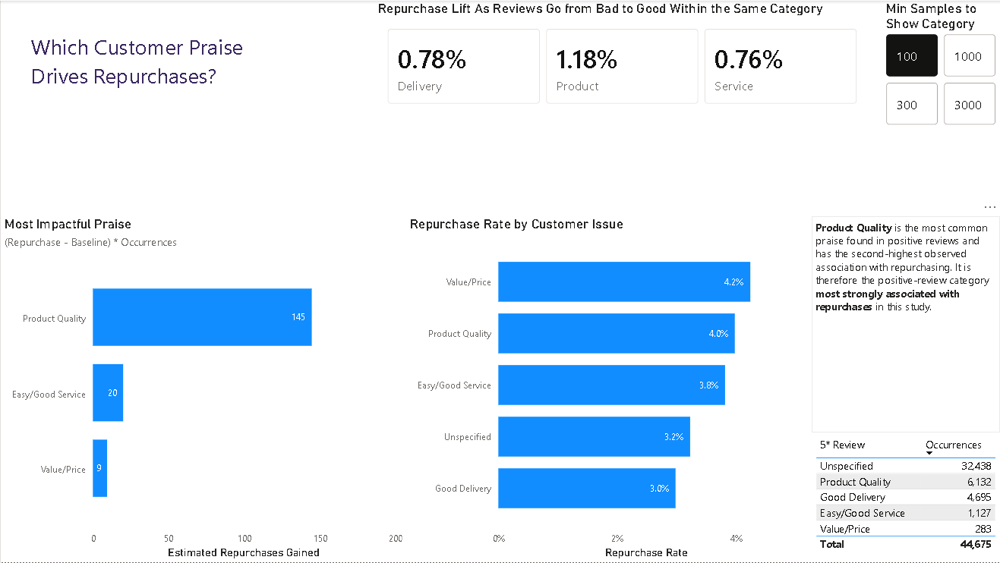

# Analyzing Customer Review Messages with LLMs to Identify Key Drivers of Churn and Retention

Customer churn and repurchase behavior are critical metrics for business sustainability, yet unstructured qualitative data, such as customer review messages, often remains underutilized due to manual classification bottlenecks.

This project leverages Large Language Models (LLMs) to perform zero-shot categorization of unstructured customer reviews written in Brazilian Portuguese for Olist. By transforming free-form feedback into structured categories, the analysis identifies customer friction points and quantifies their relationship with churn and repurchase behavior to understand why they do - *or don't* - return.

The resulting insights highlight which types of customer issues are most strongly associated with lost customers, providing actionable opportunities to improve retention.

---

**Executive Summary**
 • Delivery issues were the negative feedback category most strongly associated with churn, cutting customer repurchase rates in half compared to the baseline.  • Positive feedback around product quality was strongly associated with higher repurchase rates.  • The overall customer repurchase rate was 3%, highlighting a significant retention challenge and raising questions about long-term customer value.

---

| Category | Insight | Recommendation |
| :--- | :--- | :--- |
| **Delivery Issues** | • **Strongest Churn-Associated Factor:** Accounted for **2/3 of customer losses** observed in the study.  • **Highest Negative Volume:** Represented the most common negative feedback theme and correlated with the lowest repurchase rate (**1.6% vs. 3.3% baseline**).  • **Asymmetric Impact:** Positive delivery praise showed little to no effect on boosting repurchase rates. | • **Address Baseline Expectations:** On-time delivery is expected as standard service; preventing delays matters far more than over-performing.  • **Investigate Root Causes:** A follow-up analysis on delivery timestamps and freight costs can help identify specific bottlenecks.  • **Brand Messaging:** Focus marketing copy around reliability and shipment consistency. |
| **Product Quality Praise** | • **Highest Retention Engine:** Appeared in **50% of all positive reviews** containing a message and drove the **2nd highest repurchase rate (~4%)**.  • **Delight Factor:** Unlike delivery, where speed is merely expected, customers are highly receptive to exceptional product quality.  • **Low Churn Risk:** Negative reviews regarding product quality did not correlate strongly with churn, highlighting the opposite dynamic to delivery friction. | • **Seller Quality Incentives:** Consider seller encouragement programs such as fee discounts or badge priority for merchants with consistently high quality scores.  • **Surprise-and-Delight Marketing:** Center campaigns around exceeding product expectations and spotlighting customer experiences.  • **Leverage Quality Assets:** Feature real customer praise in retention campaigns to reinforce the value of the products. |
| **Missing / Misaligned Items** | • **Secondary Churn Drivers:** These issues show moderate volume and a meaningful association with churn. | • **Checks and Audits:** Improve barcode scanning or weight checks during packaging.  • **Listing Accuracy:** Review high-return or low-rating SKUs to improve product pictures and descriptions. |
| **Payment, Value & Price** | • **Low Volume, High Impact:** Mentions are extremely rare (<1% of reviews), but exhibit a disproportionately strong association with churn and repurchase behavior. | • **Expanded Data Sampling:** A larger dataset could confirm statistical significance and determine whether addressing these issues produces meaningful retention gains. |
| **Cohort Retention vs. Market Benchmarks** | • **Low Baseline Retention:** **Overall repurchase rate was ~3%**, contrasting sharply with benchmarks such as Mercado Libre's reported ~11 purchases/year.  • **Early-Stage Dataset:** The dataset reflects Olist's first two years of operations (2016–2018), capturing an early logistics network and relatively low brand awareness.  • **Transactional Model:** The customer base shows a high reliance on one-off marketplace purchases rather than habituated platform usage. | • **Longitudinal Cohort Study:** Track retention curves over 12, 24, and 36-month windows as the platform matures to measure true customer lifetime value.  • **Seller Retention Incentives:** Explore cross-category bundling and loyalty programs to incentivize repeat purchases across the seller ecosystem.  • **Fix Delivery Friction:** Prioritize resolving fulfillment delays—the strongest churn-associated factor—to improve first-purchase retention. |
